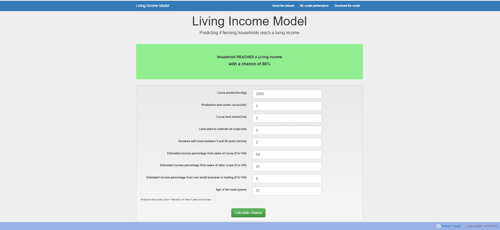
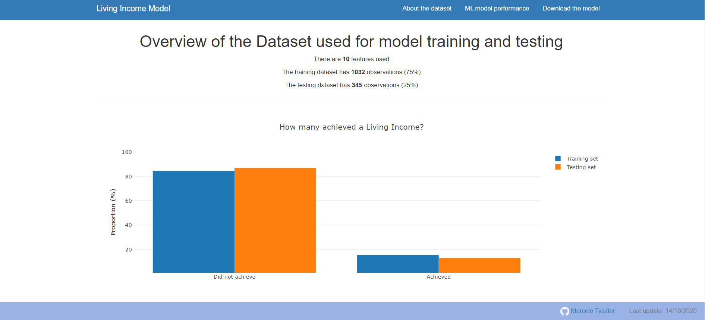
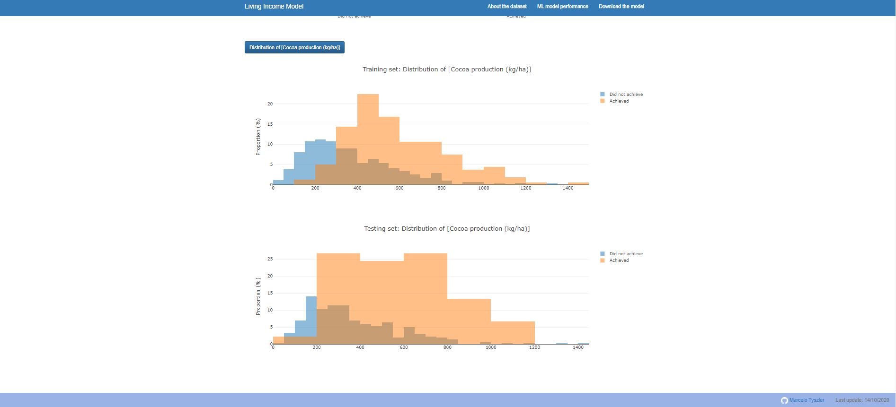
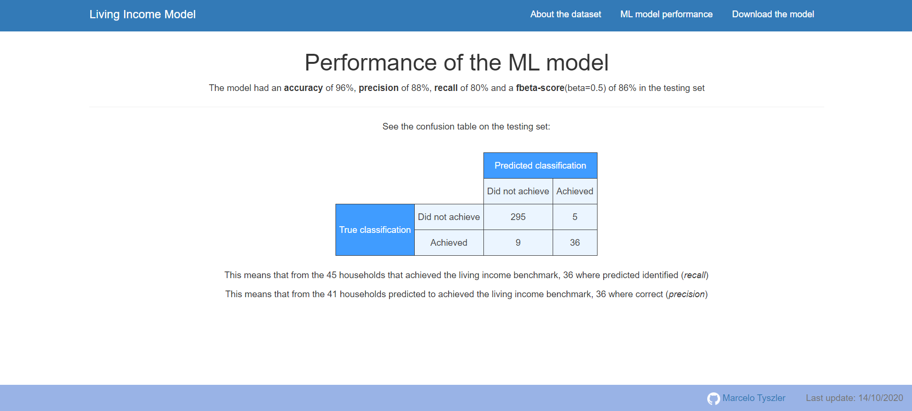
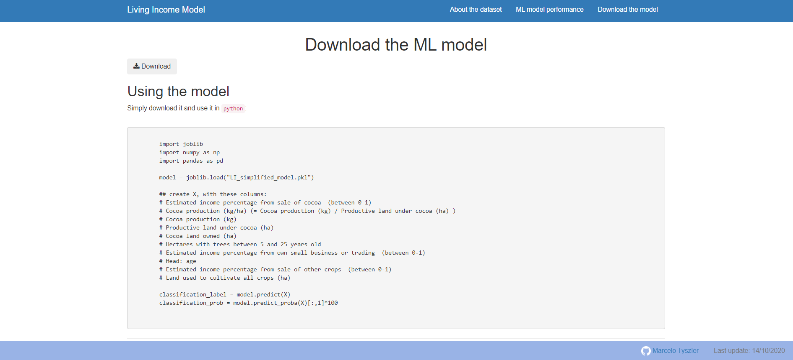

[](https://living-income-model.herokuapp.com/)

# LIVING INCOME Model: a machine learning approach towards Living Income predictions

[](https://creativecommons.org/licenses/by-sa/4.0/)

[Last update 17/12/2020] 

_notebooks re-run on 24/10/2022  (except TPOT) to update heroku build matching python 3.10.8 and updated dependencies_

In this repo I use previous [data](https://dataverse.harvard.edu/dataset.xhtml?persistentId=doi:10.7910/DVN/82TWZJ) from a [larger project](https://www.kit.nl/project/demystifying-cocoa-sector/) to develop a Machine Learning model to predict if farmers reach the living income benchmark value, **using only 9 indicators**.

This is a continuation of the work presented in [Living Income Analysis](https://github.com/mtyszler/LivingIncomeAnalysis). 
The work is advanced in two ways:

1. The model is simplified to use only 9 variables, which makes it very accesible (applied) researchers and decision makers
2. The model is made directly available in a [web app](https://living-income-model.herokuapp.com/)

The web app is inspired by the web app develop for the project https://github.com/mtyszler/Disaster-Response-Project

## Key files
The key files in this repo are:

#### Exploratory Notebooks:

* [LivingIncomeAnalysis.ipynb](analysis%20notebooks/LivingIncomeAnalysis.ipynb) : notebook where I wrangle the data, compute indicators and analyze whether farmers reach a living income
* [LivingIncome_MachineLearning.ipynb](analysis%20notebooks/LivingIncome_MachineLearning.ipynb) : notebook where I tune and fit the broad machine learning model
* [LivingIncome_Model.ipynb](analysis%20notebooks/LivingIncome_Model.ipynb) : notebook where I tune and fit the restricted machine learning model with the top 10 features

#### Machine Learning model

The model can be downloaded [here](https://github.com/mtyszler/LivingIncomeModel/raw/master/models/LI_simplified_model.pkl).

To use it in `python`:

```python
import joblib
import numpy as np
import pandas as pd

model = joblib.load("LI_simplified_model.pkl")

## create X, with these columns:
# Estimated income percentage from sale of cocoa  (between 0-1)
# Cocoa production (kg/ha) (= Cocoa production (kg) / Productive land under cocoa (ha) )
# Cocoa production (kg)   
# Productive land under cocoa (ha)    
# Cocoa land owned (ha)   
# Hectares with trees between 5 and 25 years old  
# Estimated income percentage from own small business or trading  (between 0-1)
# Head: age 
# Estimated income percentage from sale of other crops  (between 0-1)  
# Land used to cultivate all crops (ha) 

classification_label = model.predict(X)
classification_prob = model.predict_proba(X)[:,1]*100
```

## Web app:
The web app has 4 pages:

### Home (= landing page)


This page has form to input 9 farming household characteristics. After clicking `Calculate chance` the app returns the prediction and probability of achieving the living income benchmark. 

This is the main use of the app.


### About the dataset



This page has some basic info about the training and testing datasets, as well as graphs about the all the features.
It contains a bar chart showing how many observations reach the living income benchmark in the training and testing sets, as well as 
histograms of all the 9 features, compared between those achieving and not achieving the living income benchmark in the training and testing sets.

### ML model performance


This page has some info about the performance of the ML model. It shows a few metrics as well as a confusion table.


### Download the model


In this page the user can download the model for own use in `python`. It contains basic script explaining how to use the model.

### Local use

To run the web app locally:

`python app/run.py` then go to http://0.0.0.0:3001/ or localhost:3001

* Alternatevely, in unix system type:
`gunicorn app.run:app -b 0.0.0.0:3001` to run a local gunicorn server

### Live Demo

A live version of the app can be see at https://living-income-model.herokuapp.com/

### Web app Requirements

This projects uses **Python 3.10.8** and was developed in windows 10 system. Python package requirements for the web app can be found in [`requirements.txt`](https://github.com/mtyszler/LivingIncomeModel/blob/main/requirements.txt).

Because the project is deployed at Heroku, build-22.


## Write-ups:

There are 3 write-ups related to this project:

* An initial non-technical blog post about the findings of the initial analysis can be found at [Medium](https://medium.com/@tyszler.jobs/are-cocoa-farmers-reaching-a-living-income-f7724af574c4?sk=344c18d46a7fd402d3a137061c6ba89a)
* A follow-up non-technical blog post about the findings of the this analysis and web app can be found at [Medium](https://mtyszler.medium.com/are-farmers-reaching-a-living-income-c15523a564b2)
* A technical write-up about this project can be found at [Medium](https://mtyszler.medium.com/are-farmers-reaching-a-living-income-the-machine-learning-technical-companion-c8e4574868da)

### Author

Marcelo Tyszler

www.marcelotyszler.com

[](mailto:mtyszler@gmail.com)
[](https://www.linkedin.com/in/mtyszler/)


## License
[](https://creativecommons.org/licenses/by-sa/4.0/)

This work is licensed under the Creative Commons Attribution-ShareAlike 4.0 International License. 
To view a copy of this license, visit http://creativecommons.org/licenses/by-sa/4.0/.

